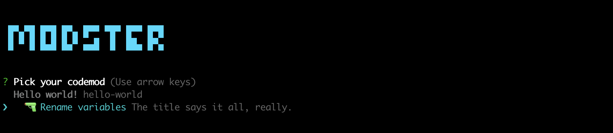

# modster-plugin-hello-world

A very simple plugin for [Modster](https://github.com/obweger/modster). Take your Modster plugin development from here! ✌️



## Installation

```shell
npm install modster-plugin-hello-world
```

In your `.codemods.js`:

```js
module.exports = {
    // ...
    plugins: [
        // ...
        'hello-world'
    ]
}
```

## Codemods

### Rename variables

Renames all variables of name `--from` to `--to`. Take this as a starting point for your own Modster plugins and codemods!
