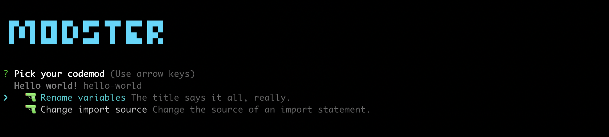

# modster-plugin-hello-world

A very simple plugin for [Modster](https://github.com/obweger/modster). Take your Modster plugin development from here! ✌️



## Installation

```shell
npm install modster-plugin-hello-world
```

In your `.codemods.js`:

```diff
module.exports = {
    // ...
    plugins: [
        // ...
+      'hello-world'
    ]
}
```

## Codemods

### Rename variables

Renames all variables of name `--from` to `--to`.

With `--from=foo` and `--to=bar`:

```diff
-   const foo = 'bar';
+   const bar = 'bar';   
```

### Change import source

Changes all import statement with source `--from` to `--to`. 

With `--from=foo` and `--to=bar`:

```diff
-   import bar from 'foo';
+   import bar from 'bar';   
```
Renames all variables of name `--from` to `--to`. Take this as a starting point for your own Modster plugins and codemods!
